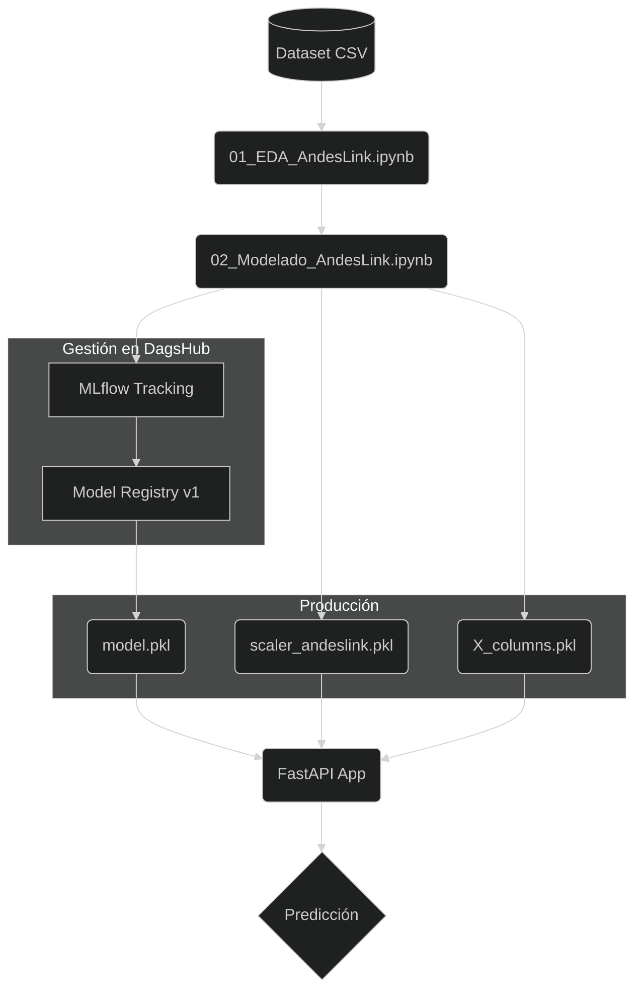
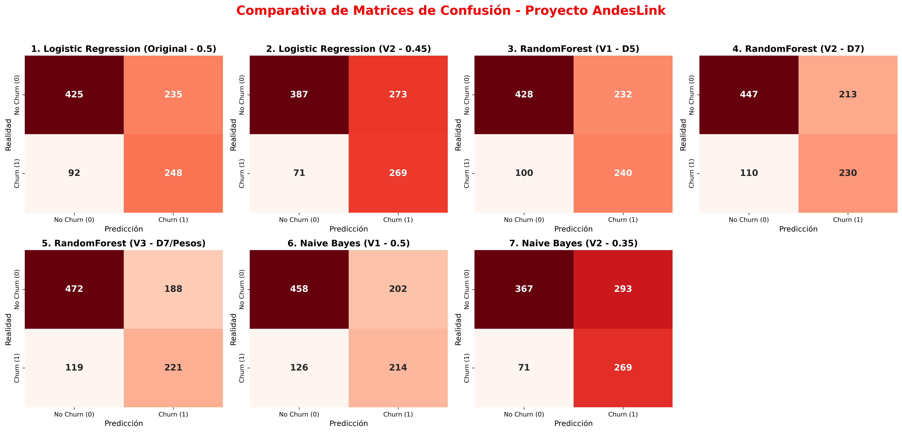

# **PROYECTO DE PREDICCIÓN DE CHURN - AndesLink**

### Carrera: **Ciencia de Datos e IA - 2do Año**
### Alumno: **Juan Manuel Resquin**
### Materia: **Laboratorio de Minería de Datos**

* [Repositorio del Proyecto en DagsHub](https://dagshub.com/JuanManuelResquin84/Proyecto_AndesLink)
* [Registro de Experimentos (MLflow)](https://dagshub.com/JuanManuelResquin84/Proyecto_AndesLink.mlflow)

# **OBJETIVO**
### Este proyecto implementa un sistema de MLOps de extremo a extremo para predecir la pérdida de clientes (Churn) en AndesLink. El sistema no solo analiza datos, sino que gestiona el ciclo de vida del modelo mediante el registro de experimentos, control de versiones y despliegue de una API.
### **Limitaciones del Proyecto:** El dataset utilizado es sintético, por lo que carece de factores externos reales (estacionalidad, cambios macroeconómicos o acciones de la competencia) que influyen en el Churn. El modelo es una base sólida, pero requeriría re-entrenamiento con datos reales de producción para ajustar los umbrales de decisión.

# **TECNOLOGÍAS Y ENTORNO**

* **Entorno:** 
  * pycaret_env (utilizado para el Norebook de 01_EDA_AndesLink.ipynb), ya que tenia conflictos con la libreria de MLflow, pero me sirvio para decidirme por el modelo de entrenamiento.
  * churn_env (utilizado para el Norebook de 02_Modelado_AndesLink.ipynb), Optimizado para MLflow y producción.

* **Seguimiento de Experimentos:** MLflow integrado con DagsHub.

* **Modelado:** Scikit-Learn (Logistic Regression, Random Forest, Naive Bayes).

* **API Framework:** FastAPI con documentación interactiva (Swagger).

# **ARQUITECTURA DE SOLUCIÓN**

# **FASE 1:** Análisis Exploratorio (EDA) (01_EDA_AndesLink.ipynb)

### Se realizó una auditoría de calidad sobre 5000 registros.

## **Distribución de Clientes (Gráfico de Barras)**

### Este gráfico mide el desequilibrio de clases en el dataset.

### Donde la gran mayoría de los clientes se mantienen (0), pero tenemos una cantidad significativa de abandonos (1).

### **Interpretación:** Visualmente, parece que el churn representa aproximadamente un 30-35% de la base total.

### Para entrenar un modelo de Machine Learning más adelante, este "desbalance" es importante; si el grupo 1 fuera mucho más pequeño, tendrías que usar técnicas especiales (como sobremuestreo), para que el modelo aprenda bien a identificar a los que se van.

# **Promedio de Tickets de Soporte vs. Churn (Barplot con error)**

### Este gráfico muestra la relación entre la frustración técnica/administrativa y la salida del cliente.

### Existe una correlación clara. Los clientes que abandonan generan, en promedio, más tickets de soporte (cerca de 1.9) que los que se quedan (aprox. 1.6).

### La fricción en el servicio es un disparador del abandono.

### Las pequeñas líneas negras arriba de las barras (barras de error) son cortas, lo que significa que esta diferencia es estadísticamente significativa y no es resultado del azar.

# **Meses de Antigüedad vs. Churn (Boxplot)**

### Aquí comparamos la "lealtad" en tiempo. El boxplot muestra la mediana (la línea negra central) y la dispersión del 50% de los datos (la caja azul).

### Osea los clientes que se quedan (0) tienen una mediana de antigüedad notablemente más alta (cerca de los 40 meses), que los que se van (1) (cuya mediana está cerca de los 30 meses).

### La hipótesis de que "los nuevos se van más" parece ser correcta. 
### La caja del grupo 1 está más abajo en el eje Y, lo que indica que el riesgo de abandono es mayor durante los primeros dos años y medio de contrato.

# **Estrategia:**

### Tenemos un problema de retención concentrado en los clientes más nuevos (menos de 30 meses), y aquellos que experimentan problemas técnicos recurrentes (reflejado en el mayor volumen de tickets). 

### Para bajar el churn, deberíamos enfocarnos en mejorar la experiencia de soporte.

### Y crear planes de fidelización para los clientes que llevan menos de dos años con nosotros. 

# **Selección del Modelo**
### Tras evaluar 14 modelos para el Proyecto AndesLink, seleccione la de Regresión Logística (lr) como la opción más robusta. Este modelo logra el equilibrio, alcanzando un **F1-Score de 0.60** y con los índices **Kappa (0.3508)** y **MCC (0.3624)** más altos.

### A diferencia de otros algoritmos que presentan un sesgo hacia una sola métrica, la de Regresión Logística garantiza un **Recall del 71.2%**, permitiendo capturar a la gran mayoría de clientes en riesgo de abandono, mientras mantiene una precisión suficiente para optimizar los recursos de fidelización y reducir el impacto de los falsos positivos.

### **Próximos pasos:** Con la base de datos validada, se procedere la fase de 02_Modelado, donde realizare el ajuste de hiperparámetros y el registro de experimentos mediante MLflow.

# **FASE 2:** Experimentación y MLOps (02_Modelado_AndesLink.ipynb)
### En este proceso ya utilizo el entorno churn_env para el registro oficial en MLflow y exportación de los experiementos y modelos.

### A diferencia de un flujo tradicional, aquí se implementó un gobierno de modelos:
* **Tracking:** Cada entrenamiento (Naive Bayes, Random Forest, Regresión Logística) quedó registrado en DagsHub con sus métricas de Accuracy, Recall y F1-Score.
* **Modelo Ganador:** Se seleccionó Logistic Regression (V2) por su robustez, aplicando un umbral personalizado de 0.45 para maximizar la captura de clientes en riesgo.
* **Model Registry:** El modelo fue promovido a la pestaña de Models en DagsHub para control de versiones.

# **Conclusiones**

### Para un problema de Churn, yo me sigo quedando con el **Modelo Regresión Logistica**, basándome en los siguientes datos:

### Se dio un duelo en los modelos de Regresión Logística y Naive Bayes, ambos modelos son los mejores capturando clientes que se van, con un Recall idéntico de 0.7911. Sin embargo, la de **Regresión Logística con umbral 0.45** gana por calidad de predicción:

### **Mejor Precision: 0.496 vs 0.**478** del Naive Bayes. Esto significa que, al alertar sobre el Churn, la de Regresión Logística se equivoca menos.

### **Mejor F1-Score: Logro 0.609**, que es el valor más alto de los modelos, logrando un equilibrio entre no dejar escapar clientes y no saturar el área de fidelización con falsas alarmas.

### **Mejor Accuracy: 0.656 vs 0.636**, aunque no es la métrica principal, siempre es preferible un modelo que acierte más en el total de los casos.

### Descarte el Modelo de **RandomForest**, aunque tenga el Accuracy más alto (0.693), pero su Recall es muy pobre (0.65). Para AndesLink, esto significa dejar que un 35% de los clientes se vayan sin siquiera detectarlos. Es un modelo demasiado conservador.

### El Modelo **Logistic Regression** con umbral de 0.55 vs 0.45, el primero tienen un buen Accuracy (0.70 vs 0.67), pero su nivel de Recall (0.67 vs 0.72) no alcanzan la meta de detección.

# **Conclusión Final**
### El modelo Logistic_Regression_V2_Threshold_0.45 es el más inteligente para el negocio porque:
* Iguala la capacidad de detección máxima (Recall 79%).
* Es más preciso que el Naive Bayes, ahorrando recursos en campañas dirigidas a personas que no pensaban irse.
* Tiene el mejor F1-Score, lo que lo posiciona como el modelo más "maduro" del notebook 02_Modelado_AndesLink.ipynb hasta el momento.

# **FASE 3:** Implementación de API (FastAPI)

### Desarrolle una API para consultas en tiempo real.
* **Endpoints:** /predict para inferencia inmediata.
* **Normalización:** Los datos de entrada pasan por el mismo pipeline de escalado registrado en el entrenamiento.
* **Probabilidad de Fuga:** ~90.47% (Ejemplo validado).
* **Acción:** Generación automática de alerta para retención.

### **ARTEFACTOS REGISTRADOS**
### Los componentes críticos se encuentran versionados:
* **model.pkl:** El motor de decisión (Regresión Logística).
* **scaler_andeslink.pkl:** Escalador Robusto para datos numéricos.
* **X_columns.pkl:** Lista de columnas procesadas para asegurar la integridad de la matriz.

# **ANEXO: CÓMO REPRODUCIR EL PROYECTO**

1. **Clonar el repositorio:** 
* `git clone https://github.com/JuanManuelResquin84/Portafolio_03_Proyecto_AndesLink_MLOps.git`
(Asegurate de estar en la carpeta del proyecto) 
* `cd Portafolio_03_Proyecto_AndesLink_MLOps`

2. **Configurar el entorno:** 
* `conda create -n churn_env2 python=3.10 -y`
* `conda activate churn_env2`
* `pip install -r requirements_churn_env.txt`

3. **Descargar Datos y Modelos (Sincronización):**
(En lugar de configurar DVC manualmente, ejecute el siguiente comando para descargar los archivos pesados (CSV y modelos .pkl) directamente)
* `dagshub download JuanManuelResquin84/Proyecto_AndesLink . .`

4. **Ejecutar entrenamiento:** Abrir y ejecutar el notebook `02_Modelado_AndesLink.ipynb`. Esto registrará automáticamente un nuevo experimento en **MLflow**.

5. **Lanzar la API de Inferencia:** 
* `python main.py`

6. **Probar API: ingresando a la Interfaz de Prueba** 
* `http://localhost:8000/docs`
(Una vez que el servidor esté activo, acceda a la documentación interactiva para realizar predicciones en tiempo real enviando un JSON de prueba)