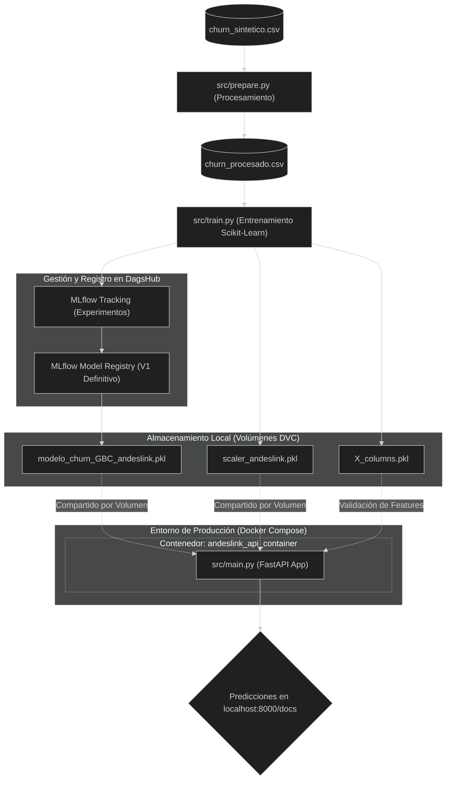
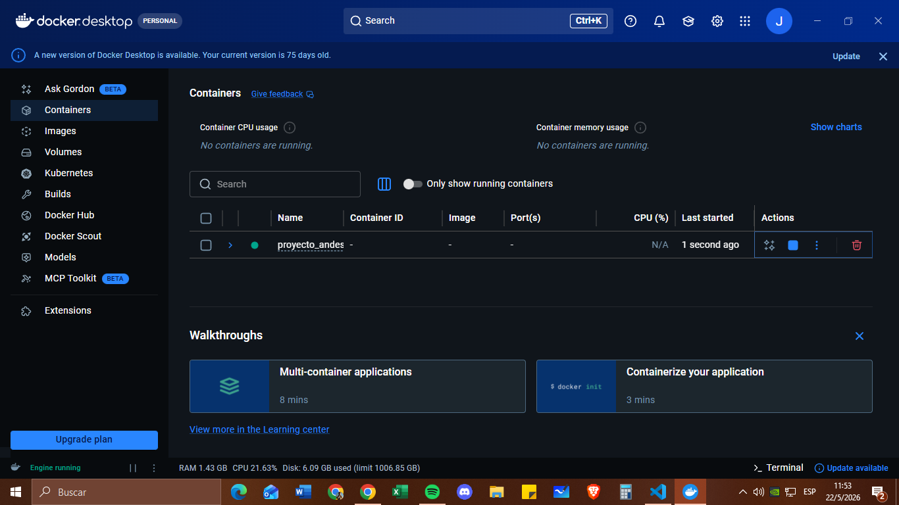

# **PROYECTO DE PREDICCIÓN DE CHURN - AndesLink**

### Carrera: **Ciencia de Datos e IA - 2do Año**
### Alumno: **Juan Manuel Resquin**
### Materia: **Laboratorio de Minería de Datos**

>* [Repositorio del Proyecto en DagsHub](https://dagshub.com/JuanManuelResquin84/Proyecto_AndesLink)

>* [Registro de Experimentos (MLflow)](https://dagshub.com/JuanManuelResquin84/Proyecto_AndesLink.mlflow)

# **OBJETIVO**
### Este proyecto implementa un sistema de **MLOps de extremo a extremo (End-to-End)** para predecir la pérdida de clientes (*Churn*) en la empresa **AndesLink**. El sistema abarca todo el ciclo de vida de la solución mediante una arquitectura profesional que integra:

# **ARQUITECTURA DE SOLUCIÓN**

### **Gobernanza y Tracking de Datos y Modelos:** Control de versiones de artefactos pesados y datasets mediante **DVC (Data Version Control)** con almacenamiento remoto.

> * **Gestión del Ciclo de Vida del Modelo:** Registro centralizado de experimentos, métricas, hiperparámetros y versionado de modelos a través de **MLflow** integrado con **DagsHub**.

> * **Despliegue de Inferencia:** Creación de una API REST productiva utilizando **FastAPI** sustentada sobre el servidor **Uvicorn** con documentación interactiva integrada.

> * **Infraestructura y Despliegue Reproducible:** Empaquetamiento y aislamiento completo del entorno de ejecución mediante contenedores con **Docker** y **Docker Compose**.

> * **Integración Continua (CI):** Automatización del control de calidad mediante un pipeline en **GitHub Actions** que valida el código y ejecuta pruebas unitarias con **pytest** de manera automatizada ante cada Pull Request.

### **Limitaciones del Proyecto:** El dataset utilizado es sintético, por lo que carece de factores externos reales (estacionalidad, cambios macroeconómicos o acciones de la competencia) que influyen en el Churn. El modelo es una base sólida, pero requeriría re-entrenamiento con datos reales de producción para ajustar los umbrales de decisión en un entorno vivo.

# **TECNOLOGÍAS Y ENTORNO**

### **Entorno de Desarrollo y Producción:** 

> * **`churn_env2`:** Entorno virtual optimizado con Python 3.10, utilizado tanto para la experimentación en el Notebook (`01_AndesLink.ipynb`) como para las dependencias del servidor de producción (**`requirements_churn_env2.txt`**).

### **Gobernanza y Control de Versiones:**

> **Git & GitHub:** Control de versiones del código fuente y gestión de ramas de trabajo.

> **DVC (Data Version Control):** Gestión y versionado de datasets y artefactos binarios pesados (**`.pkl`**).

> **DagsHub:** Almacenamiento remoto unificado para el código (Git), los datos (DVC) y el servidor de tracking.

### **Seguimiento de Experimentos (Mangement):** 

>* **MLflow:** Registro centralizado de parámetros, métricas de negocio (**Precision, Recall, Accuracy, Kappa**) y custodia del modelo en el *Model Registry*.

### **Modelado y Ciencia de Datos:** 

>* **Scikit-Learn:** Implementación y optimización de algoritmos de ensamble (**Gradient Boosting Classifier*, *CatBoost Classifier*, *AdaBoost Classifier**).

### **Servicio de Inferencia (API):** 

>* **FastAPI:** Framework moderno y asincrónico para la construcción de la API REST.

> **Uvicorn:** Servidor ASGI de alta velocidad para la ejecución de la app.

> **Swagger UI:** Documentación interactiva nativa expuesta en `/docs` para pruebas de consumo.

### **Infraestructura e Integración Continua (CI/CD):**

> **Docker & Docker Compose:** Contenedorización, aislamiento y orquestación del despliegue reproducible local.

> **GitHub Actions:** Pipeline automatizado para la ejecución de pruebas unitarias mediante **pytest** ante cada Pull Request.

# **FASE 1:** Análisis Exploratorio (EDA) (01_AndesLink.ipynb)

### Se realizó una auditoría de calidad sobre 5000 registros.

## **Distribución de Clientes**

### Este gráfico mide el desequilibrio de clases en el dataset.

### Donde la gran mayoría de los clientes se mantienen (0), pero tenemos una cantidad significativa de abandonos (1).

### **Interpretación:** Visualmente, parece que el churn representa aproximadamente un 30-35% de la base total.

### Para entrenar un modelo de Machine Learning más adelante, este "desbalance" es importante; si el grupo 1 fuera mucho más pequeño, tendrías que usar técnicas especiales (como sobremuestreo), para que el modelo aprenda bien a identificar a los que se van.

# **Promedio de Tickets de Soporte vs. Churn**

### Este gráfico muestra la relación entre la frustración técnica/administrativa y la salida del cliente.

### Existe una correlación clara. Los clientes que abandonan generan, en promedio, más tickets de soporte (cerca de 1.9) que los que se quedan (aprox. 1.6).

### La fricción en el servicio es un disparador del abandono.

### Las pequeñas líneas negras arriba de las barras (barras de error) son cortas, lo que significa que esta diferencia es estadísticamente significativa y no es resultado del azar.

# **Meses de Antigüedad vs. Churn**

### Aquí comparamos la "lealtad" en tiempo. El boxplot muestra la mediana (la línea negra central) y la dispersión del 50% de los datos (la caja azul).

### Osea los clientes que se quedan (0) tienen una mediana de antigüedad notablemente más alta (cerca de los 40 meses), que los que se van (1) (cuya mediana está cerca de los 30 meses).

### La hipótesis de que "los nuevos se van más" parece ser correcta. 
### La caja del grupo 1 está más abajo en el eje Y, lo que indica que el riesgo de abandono es mayor durante los primeros dos años y medio de contrato.

# **Estrategia:**

### Tenemos un problema de retención concentrado en los clientes más nuevos (menos de 30 meses), y aquellos que experimentan problemas técnicos recurrentes (reflejado en el mayor volumen de tickets). 

### Para bajar el churn, deberíamos enfocarnos en mejorar la experiencia de soporte.

### Y crear planes de fidelización para los clientes que llevan menos de dos años con nosotros. 

# **FASE 2:** 

## **Modelado Científico y Selección de la Solución****

### Para ir por el camino más conservador (priorizando el cuidado del presupuesto y evitando regalar promociones a clientes que no tenían intenciones de irse), se seleccionó como la mejor opción el **modelo Gradient_Boosting_Train_V1**. Con un ajuste fino de hiperparámetros y un umbral óptimo de decisión de **0.45**, logramos el balance ideal para una estrategia de *"costo controlado"*.

### **Auditoría y Tracking con MLflow:** Esta selección está respaldada por datos duros. Todo el proceso de entrenamiento y la comparación de los algoritmos (*Gradient Boosting, CatBoost y AdaBoost*) fueron registrados en tiempo real en nuestro servidor de **MLflow integrado con DagsHub**. El modelo ganador fue versionado y custodiado formalmente en el **MLflow Model Registry** para su pase a producción.

### **Justificación detallada de por qué este es el modelo para el negocio:**

> * **Máxima Eficiencia Presupuestaria (Mayor Precisión):** Evita el desperdicio de dinero en campañas masivas. La métrica clave que controla el gasto innecesario es la **Precisión**, y la versión V1 del GBC alcanzó un **0.5714 (57.14%)**.

> * **¿Qué significa en la vida real?:** De cada 100 personas a las que el modelo les ponga el cartel de *"¡Ojo, este cliente se va!"*, más de 57 realmente se van a ir. Minimizamos los Falsos Positivos: no regalamos descuentos a clientes fieles.

>*  **Cobertura Optimizada (Adiós a la Trampa del Recall):** Con la versión V1, el **Recall subió a 0.5529 (55.29%)**.

>* **Impacto operativo:** Logramos romper el cuello de botella. Ahora atrapamos a más de la mitad de los clientes en riesgo real de fuga, pero sin volvernos masivos ni saturar al equipo de retención de AndesLink. Mantenemos el **"tiro de precisión"**.

>* **Consistencia Estadística (Kappa Alto y Buen Accuracy):** El **Accuracy (0.7070)** demuestra que el modelo acierta globalmente en 7 de cada 10 casos. Sin embargo, lo más importante es el **índice Kappa (0.3419)**, el cual certifica que las predicciones del modelo son sólidas, estables y están bien fundamentadas por los patrones de los datos, descartando que el éxito sea fruto del azar o del desbalance de clases.

# **Resumen del plan estratégico con GBC V1:**

> * **Campañas Quirúrgicas:** Contactarás a un volumen moderado de clientes (Recall ~55%), asegurando que el equipo de atención al cliente de AndesLink no se sature con falsas alarmas.

> * **Alta Efectividad:** La mayoría de los contactos serán sobre riesgos de fuga reales (Precisión ~57%).

>* **Optimización del ROI:** El dinero que ahorramos al no emitir falsas alarmas nos permite financiar promociones de mayor impacto o valor para los clientes que sí están en la cuerda floja, maximizando la tasa de éxito de la campaña de retención.

# **Conclusión:** 
### Si la prioridad número uno de la empresa es optimizar cada peso invertido en retención, el modelo **Gradient_Boosting_Train_V1** es la elección financiera, técnica y de MLOps más inteligente para el negocio. 

# **FASE 3: Despliegue de la API de Inferencia (FastAPI) y Dockerización**

### Para la puesta en producción del modelo optimizado (`Gradient_Boosting_Train_V1`), se transformó la solución en un servicio desacoplado, independiente y reproducible.

>* **Framework de Inferencia:** Se desarrolló una API REST utilizando **FastAPI** sustentada sobre el servidor **Uvicorn**, garantizando alta velocidad de respuesta y asincronismo para las peticiones de negocio.

> * **Endpoints Estratégicos:** El punto de acceso principal es `/predict`, el cual recibe un payload en formato JSON con las características del cliente, aplica la normalización estadística en tiempo real y devuelve la predicción de Churn de forma inmediata.

> * **Consistencia en el Preprocesamiento:** Los datos entrantes a la API no se procesan "a ciegas"; son transformados exactamente por las mismas reglas del pipeline de ingeniería de datos usando el escalador binario guardado en la etapa de entrenamiento, evitando cualquier tipo de *data leakage*.

>* **Consumo Controlado:** Expone una interfaz interactiva de pruebas basada en **Swagger UI** (disponible nativamente en `/docs`), permitiendo que el equipo de sistemas o cualquier frontend (como un módulo de atención al cliente de AndesLink) pueda testear integraciones inmediatamente.

# **Infraestructura y Reproducibilidad (DOCKER)**

### Para aislar por completo la capa de aplicación y asegurar el cumplimiento estricto de un **Despliegue Reproducible**, se diseñó la siguiente arquitectura de infraestructura local:

> * **Contenedorización (`Dockerfile`):** Se empaquetó la aplicación web basándose en una imagen oficial liviana de Python (`python:3.10-slim`), aislando todas las librerías del sistema y de ciencia de datos indicadas en las dependencias, garantizando un entorno liviano y seguro.

>* **Orquestación (`docker-compose.yml`):** Se implementó Docker Compose para comandar la creación, configuración de puertos (mapeo del puerto `8000`) y el encendido automatizado del contenedor (`andeslink_api_container`).

>* **Arquitectura de Volúmenes Locales:** En lugar de embeber los archivos pesados dentro de la imagen de Docker, se configuraron **volúmenes**. Esto vincula de forma segura la carpeta local de nuestra máquina (donde descargamos previamente los artefactos con DagsHub) con el interior del contenedor. Esto permite que el entorno productivo sea compacto, eficiente y cerrado ante modificaciones externas, cargando el modelo en memoria al iniciar el servicio.

>**Nota de Seguridad e Inferencia Puro:** El contenedor Docker está optimizado exclusivamente para tareas de **Inferencia**. Las credenciales de escritura de MLflow/DagsHub no fueron inyectadas en la imagen de producción por diseño de seguridad. Cualquier intento de ejecutar re-entrenamientos (`src/train.py`) dentro del contenedor fallará, protegiendo así los tokens de acceso de la organización.

# **Artefactos Versionados y Registrados**

### Los componentes críticos de esta versión productiva (V1) se encuentran custodiados bajo el ecosistema de **DVC** y bajo control de versiones físicas en el almacenamiento remoto:

> * **`modelo_churn_GBC_andeslink.pkl`**: El motor de inferencia definitivo optimizado del *Gradient Boosting Classifier*, configurado con el umbral matemático de **0.45** para el resguardo presupuestario de la empresa.

> * **`scaler_andeslink.pkl`**: El transformador de variables con los parámetros de distribución ajustados sobre el dataset de entrenamiento, vital para asegurar la fidelidad del dato ingresado a la API.

> * **`X_columns.pkl`:** Estructura de columnas (features) preservada del entrenamiento. Es el contrato de datos necesario para asegurar que el pipeline de inferencia no sufra data drift o errores de orden en las variables al momento de realizar la predicción.

# **FASE 4: Integración Continua (CI) con GitHub Actions**

### Para garantizar la estabilidad del sistema y asegurar que ninguna modificación rompa la API en producción, se implementó un flujo de **Integración Continua (CI)** mediante **GitHub Actions**. 

### Este pipeline actúa como un "Escudo de Calidad" automatizado que se dispara de forma obligatoria ante cada `Push` o `Pull Request` hacia la rama `main`.

# **El Flujo Automatizado en la Nube:**

>* **Aislamiento del Entorno:** GitHub Actions levanta un servidor limpio en la nube (`ubuntu-latest`) e instala la versión exacta de **Python 3.10**.

>* **Conexión Segura con DagsHub (Secrets):** El robot se conecta a DagsHub de forma encriptada utilizando variables de entorno protegidas (`DAGSHUB_USERNAME` y `DAGSHUB_TOKEN`), garantizando la seguridad de las credenciales de la empresa.

>* **Descarga de Artefactos Pesados (DVC):** Utilizando la CLI nativa de **DVC**, el pipeline descarga automáticamente el modelo (`modelo_churn_GBC_andeslink.pkl`) y el escalador (`scaler_andeslink.pkl`) directo al servidor virtual.

>* **Pruebas Unitarias Automatizadas (`pytest`):** Se ejecutan los tests de calidad del software para validar que:
>   * El servidor de FastAPI levanta correctamente.
>   * El endpoint `/predict` responde con un código `200 OK`.
>   * Las predicciones del modelo devuelven la estructura JSON esperada por el negocio.

# **Valor Estratégico para el Negocio:**

> * **Despliegues sin Errores:** Si un desarrollador sube un cambio que rompe el preprocesamiento o altera una variable, el robot bloquea el botón de **Merge** automáticamente (el check se pone en rojo).

> * **Gobernanza de Código:** El administrador del proyecto (en este caso, vos) solo autoriza el paso a producción de código que ya fue testeado y aprobado por el robot (check en verde).

# **ANEXO: CÓMO REPRODUCIR EL PROYECTO**

1. **Clonar el repositorio:** 
* `git clone https://github.com/JuanManuelResquin84/Portafolio_03_Proyecto_AndesLink_MLOps.git`
(Asegurate de estar en la carpeta del proyecto) 
* `cd Portafolio_03_Proyecto_AndesLink_MLOps`

2. **Configurar el entorno:** 
* `conda create -n churn_env2 python=3.10 -y`
* `conda activate churn_env2`
* `pip install -r requirements_churn_env2.txt`

3. **Descargar Datos y Modelos (Sincronización):**
* `dagshub download JuanManuelResquin84/Proyecto_AndesLink . .`

4. **Construir y levantar el contenedor:** 
Ejecute el siguiente comando para que Docker Compose construya la imagen e inicie el servicio de forma automatizada:
* `docker compose up --build`

5. **Acceder a la API de Inferencia:** 
Una vez que la terminal indique que el servidor Uvicorn está activo, abra su navegador e ingrese a:
* `http://localhost:8000/docs`
(Documentación interactiva de FastAPI para realizar predicciones enviando un JSON de prueba)...

