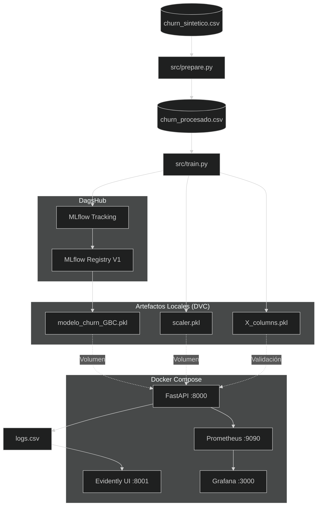
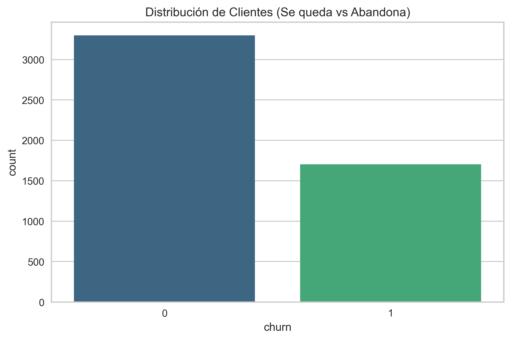
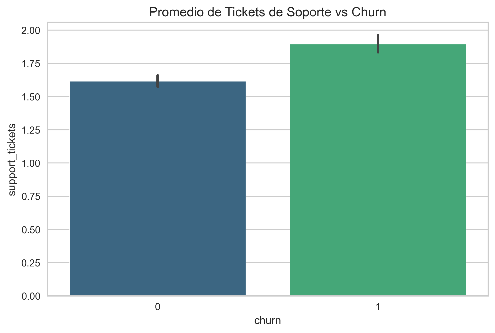
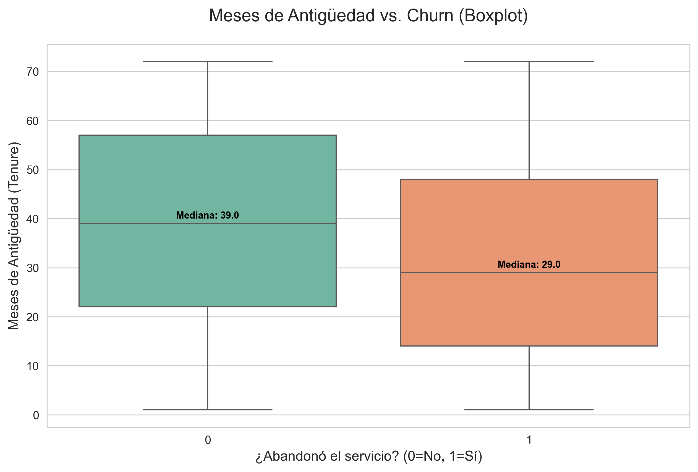
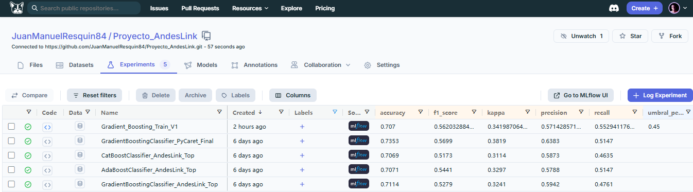

# **PROYECTO DE PREDICCIÓN DE CHURN - AndesLink**

### Carrera: **Ciencia de Datos e IA - 2do Año**
### Alumno: **Juan Manuel Resquin**
### Materia: **Laboratorio de Minería de Datos**
### Profesor: **Diego Mosquera**
---
>* [Repositorio del Proyecto en DagsHub](https://dagshub.com/JuanManuelResquin84/Proyecto_AndesLink)

>* [Registro de Experimentos (MLflow)](https://dagshub.com/JuanManuelResquin84/Proyecto_AndesLink.mlflow)
---
## **📋 TABLA DE CONTENIDOS**
1. [Objetivo](#objetivo)
2. [Arquitectura de Solución](#arquitectura-de-solución)
3. [Decisiones de Arquitectura](#decisiones-de-arquitectura)
4. [Tecnologías](#tecnologías)
5. [Fase 1: EDA](#fase-1-análisis-exploratorio-eda)
6. [Fase 2: Modelado](#fase-2-modelado-científico)
7. [Fase 3: API & Docker](#fase-3-api--dockerización)
8. [Fase 4: CI/CD](#fase-4-cicd-con-github-actions)
9. [Fase 5: Monitoreo (Evidently)](#fase-5-monitoreo-con-evidently-ai)
10. [Fase 6: Observabilidad (Prometheus+Grafana)](#fase-6-observabilidad-técnica)
11. [Reproducción del Proyecto](#anexo-cómo-reproducir-el-proyecto)
---
## **OBJETIVO**
### Implementar un sistema **MLOps End-to-End** para predecir churn en AndesLink, integrando:
- Control de versiones (Git + DVC)
- Tracking de experimentos (MLflow + DagsHub)
- API de inferencia (FastAPI + Docker)
- CI/CD (GitHub Actions)
- Monitoreo de datos (Evidently AI)
- Observabilidad técnica (Prometheus + Grafana)
---
## **ARQUITECTURA DE SOLUCIÓN**

---
## **DECISIONES DE ARQUITECTURA**
### **¿Por qué separe prepare_for_evidently.py y push_to_ui.py?
| Script | Responsabilidad | Frecuencia | Por qué separarlo |
| :--- | :--- | :--- | :--- |
| `prepare_for_evidently.py` | Transformar datos (one-hot inverso, limpieza) | Cuando cambia la estructura | **Reutilización:** Los datos preparados sirven para múltiples reportes |
| `push_to_ui.py` | Generar reportes y subir a Evidently UI | Cada 6-24 horas | **Independencia:** Puedes cambiar la frecuencia sin tocar la preparación |
---
### **¿Por qué un contenedor separado para Evidently?**
| Servicio | Puerto | Propósito | Características |
| :--- | :---: | :--- | :--- |
| **FastAPI** | 8000 | Inferencia en tiempo real | Alta demanda, <100ms latencia |
| **Evidently UI** | 8001 | Dashboards de monitoreo | Baja demanda, visualización |
---
### **Ventajas**
- Aislamiento: Si Evidently falla, la API sigue operando
- Recursos: Evidently consume RAM/CPU solo cuando se visualiza
- Independencia: Actualizas Evidently sin tocar la API
---
### **¿Por qué Python 3.11-slim para Evidently?**
| Imagen | Tamaño | Python | Uso |
| :--- | :---: | :---: | :--- |
| `python:3.10-slim` | ~150MB | 3.10 | API (compatibilidad con modelo) |
| `python:3.11-slim` | ~150MB | 3.11 | Evidently (última versión estable) |

### **Razones**

- **Compatibilidad:** Evidently requiere Python 3.8+, 3.11 es la más reciente estable
- **Seguridad:** Imagen "slim" = menos vulnerabilidades
- **Flexibilidad:** Cada servicio usa la versión óptima para su propósito
---
## **TECNOLOGÍAS**

### **Data Science & ML**

> **Scikit-Learn:** Gradient Boosting, CatBoost, AdaBoost

> **MLflow:** Tracking + Model Registry

> **DVC:** Versionado de datos y modelos
---
### **Infraestructura**

> **FastAPI + Uvicorn:** API REST asíncrona

> **Docker + Docker Compose:** Contenedorización

> **GitHub Actions:** CI/CD
---
### **Monitoreo**

> **Evidently AI:** Data drift detection

> **Prometheus:** Métricas de infraestructura

> **Grafana:** Dashboards técnicos
---
## **FASE 1:** ANÁLISIS EXPLORATORIO (EDA)

### **Distribución de Clientes**
- **Churn Rate:** ~30-35% (dataset desbalanceado)
- **Implicación:** Requiere métricas como Precision/Recall, no solo Accuracy

---
### **Tickets de Soporte vs Churn**
- **Hallazgo:** Clientes que se van generan 1.9 tickets vs 1.6 los que se quedan
- **Acción:** Mejorar calidad del soporte técnico

---
### **Antigüedad vs Churn**
- **Hallazgo:** Mediana de 40 meses (se quedan) vs 30 meses (se van)
- **Acción:** Programas de fidelización para clientes < 2.5 años

---
## **FASE 2:** MODELADO CIENTÍFICO

- **Modelo Seleccionado:** Gradient Boosting Classifier V1
- **Configuración Óptima:**

```json
{
    "n_estimators": 100,
    "learning_rate": 0.1,
    "max_depth": 3,
    "umbral_personalizado": 0.45  # Ajuste de negocio
}
```
---
### **Métricas Finales**
| Métrica | Valor | Interpretación de Negocio |
| :--- | :---: | :--- |
| **Precision** | 0.5714 | De 100 alertas, 57 son reales → Evita desperdicio de presupuesto |
| **Recall** | 0.5529 | Detectamos 55% de los que se van → Cobertura balanceada |
| **Kappa** | 0.3419 | Acuerdo estadístico sólido → No es azar |
| **Accuracy** | 0.7070 | 7/10 predicciones correctas → Consistencia global |
---
### **Justificación Estratégica**
- **Problema de Negocio:** AndesLink tiene presupuesto limitado para campañas de retención.
---
### **Solución**
- **Alta Precision (57%):** No regalamos descuentos a clientes fieles (minimizamos Falsos Positivos)
- **Recall Moderado (55%):** No saturamos al equipo de atención al cliente
- **ROI Optimizado:** El dinero ahorrado en falsas alarmas financia promociones de mayor valor
---

---
## **FASE 3:** API & DOCKERIZACIÓN
### **Endpoints Principales**
| Endpoint | Método | Propósito |
| :--- | :---: | :--- |
| `/` | **GET** | Health check |
| `/predict` | **POST** | Predicción de churn |
| `/metrics` | **GET** | Métricas Prometheus |
| `/docs` | **GET** | Swagger UI interactivo |
---
### **Ejemplo de Request**
```json
{
  "tenure_months": 7,
  "monthly_charge": 58.23,
  "total_charges": 326.50,
  "support_tickets": 2,
  "late_payments": 1,
  "avg_monthly_usage_gb": 81.83,
  "contract_type": "mensual",
  "payment_method": "transferencia",
  "internet_service": "cable",
  "has_streaming": 0,
  "has_security_pack": 1,
  "num_products": 3,
  "region": "centro",
  "customer_age": 53,
  "is_promo": 1
}
```

```json
{
  "tenure_months": 34,
  "monthly_charge": 89.99,
  "total_charges": 3059.66,
  "support_tickets": 0,
  "late_payments": 0,
  "avg_monthly_usage_gb": 450.25,
  "contract_type": "anual",
  "payment_method": "tarjeta",
  "internet_service": "fibra",
  "has_streaming": 1,
  "has_security_pack": 1,
  "num_products": 5,
  "region": "sur",
  "customer_age": 28,
  "is_promo": 0
}
```

```json
{
  "tenure_months": 14,
  "monthly_charge": 45.50,
  "total_charges": 410.50,
  "support_tickets": 5,
  "late_payments": 6,
  "avg_monthly_usage_gb": 30.10,
  "contract_type": "mensual",
  "payment_method": "efectivo",
  "internet_service": "cable",
  "has_streaming": 0,
  "has_security_pack": 0,
  "num_products": 1,
  "region": "norte",
  "customer_age": 22,
  "is_promo": 1
}
```

```json
{
  "tenure_months": 60,
  "monthly_charge": 285.00,
  "total_charges": 17100.00,
  "support_tickets": 2,
  "late_payments": 0,
  "avg_monthly_usage_gb": 3200.75,
  "contract_type": "anual",
  "payment_method": "transferencia",
  "internet_service": "fibra",
  "has_streaming": 0,
  "has_security_pack": 1,
  "num_products": 8,
  "region": "centro",
  "customer_age": 45,
  "is_promo": 0
}
```

---
### **Arquitectura Docker**
### **servicios:**
> api:          → FastAPI (puerto 8000)

> evidently:    → Evidently UI (puerto 8001)

> prometheus:   → Métricas (puerto 9090)

> grafana:      → Dashboards (puerto 3000)
---
### **Volúmenes Compartidos**

> ./models → Modelo, scaler, columnas

> ./data → Dataset procesado + logs

> ./workspace → Snapshots de Evidently
---
# **FASE 4:** CI/CD CON GITHUB ACTIONS
### **Pipeline Automatizado**
```yaml
on: [push, pull_request]

jobs:
  test:
    runs-on: ubuntu-latest
    steps:
      - checkout
      - setup Python 3.10
      - install dependencies
      - download artifacts (DVC)
      - run pytest
```
### **Beneficios**

> Calidad: Bloquea merges si los tests fallan

> Seguridad: Credenciales en GitHub Secrets

>Automatización: Sin intervención manual

---
## **FASE 5:** MONITOREO CON EVIDENTLY AI

### **Arquitectura de Monitoreo**

```json
 1. API recibe predicciones              
    ↓                                    
 2. Logs se guardan en logs.csv          
    ↓                                    
 3. prepare_for_evidently.py             
    - Convierte one-hot a categóricas    
    - Genera reference_prepared.csv      
    - Genera current_prepared.csv        
    ↓                                    
 4. push_to_ui.py                        
    - Compara referencia vs actual       
    - Detecta data drift                 
    - Sube snapshot a workspace/         
    ↓                                    
 5. Evidently UI (localhost:8001)        
    - Visualiza drift                    
    - Alertas de calidad 
```
### **Scripts de Monitoreo**

> prepare_for_evidently.py

### **Propósito:** Transformar datos para Evidently

- Carga churn_procesado.csv (entrenamiento) y logs.csv (producción)
- Convierte columnas one-hot (ej: contract_type_mensual) a categóricas (contract_type)
- Guarda reference_prepared.csv y current_prepared.csv
---
### **¿Por qué separado?**
- Se ejecuta solo cuando cambia la estructura de datos
- Permite debugging independiente
- Reutilizable para múltiples análisis

>push_to_ui.py

### **Propósito:** Generar y subir reportes
- Carga datos preparados
- Crea Evidently Report con DataDriftPreset + DataSummaryPreset
- Sube snapshot a Evidently UI workspace
---
### **¿Por qué separado?**
- Se puede schedulear cada 6-24 horas
- No requiere reprocesar datos si solo cambian las predicciones
- Fácil de automatizar con cron o GitHub Actions
---
### **Dashboard Evidently**

> Acceso: http://localhost:8001

### **Métricas Monitoreadas**

> Data Drift: Cambios en distribución de variables

> Data Summary: Estadísticas descriptivas

>Alertas: Variables con drift significativo

# **FASE 6:** OBSERVABILIDAD TÉCNICA

### **Stack Prometheus + Grafana**

| Componente | Puerto | Función |
| :--- | :---: | :--- |
| **Prometheus** | 9090 | Recolecta métricas de la API |
| **Grafana** | 3000 | Visualiza dashboards |

### **Métricas Exportadas por FastAPI**

```json
- ml_prediction_latency_seconds: Histograma de latencia
- ml_predictions_total: Contador de predicciones (por resultado)
- ml_model_accuracy: Gauge de accuracy del modelo
```

### **Dashboard Grafana**

> Acceso: http://localhost:3000 (admin/admin)

### **Paneles:**
- Requests por minuto
- Latencia p95, p99
- Tasa de errores HTTP
- Distribución de predicciones (Fuga vs Se queda)

# **ANEXO:** CÓMO REPRODUCIR EL PROYECTO

### **1. Clonar Repositorio**

```json
git clone https://github.com/JuanManuelResquin84/Portafolio_03_Proyecto_AndesLink_MLOps.git
cd Portafolio_03_Proyecto_AndesLink_MLOps
```

### **2. Configurar Entorno**

```json
conda create -n churn_env2 python=3.10 -y
conda activate churn_env2
pip install -r requirements_churn_env2.txt
```

### **3. Descargar Datos y Modelos (DagsHub)**

```json
dagshub download JuanManuelResquin84/Proyecto_AndesLink . .
```

### **4. Levantar Infraestructura Docker**

```json
docker compose up --build
```

**Servicios disponibles**

> **API:** http://localhost:8000/docs

> **Evidently UI:** http://localhost:8001

> **Prometheus:** http://localhost:9090

> **Grafana:** http://localhost:3000

**5. Ejecutar Pipeline de Monitoreo**

**Paso 1** - Preparar datos (solo la primera vez o si cambia la estructura):

```json
docker exec -it andeslink_api_container python script/prepare_for_evidently.py
```

**Paso 2 - Subir reporte a Evidently UI (cada 6-24 horas):**

```json
docker exec -it andeslink_api_container python script/push_to_ui.py
```

### **6. Probar API**

### **Vía Swagger UI**

```json
Ir a http://localhost:8000/docs
Endpoint /predict → Try it out
Enviar JSON de prueba
```

### **Vía curl**

```json
curl -X POST "http://localhost:8000/predict" \
  -H "Content-Type: application/json" \
  -d '{
    "tenure_months": 24,
    "monthly_charge": 75.5,
    ...
  }'
```

# **ESTRUCTURA DEL PROYECTO**

```json
Proyecto_AndesLink/
├── data/
│   ├── churn_sintetico.csv         # Dataset original
│   ├── churn_procesado.csv         # Dataset procesado (DVC)
│   └── logs.csv                    # Logs de predicciones
├── models/
│   ├── modelo_churn_GBC_andeslink.pkl  # Modelo (DVC)
│   ├── scaler_andeslink.pkl            # Scaler (DVC)
│   └── X_columns.pkl                   # Columnas (DVC)
├── src/
│   ├── prepare.py                  # Pipeline de preparación
│   ├── train.py                    # Pipeline de entrenamiento
│   └── main.py                     # FastAPI app
├── script/
│   ├── prepare_for_evidently.py    # Prep datos para monitoreo
│   └── push_to_ui.py               # Push reportes a Evidently
├── tests/
│   └── test_api.py                 # Tests unitarios
├── prometheus/
│   └── prometheus.yml              # Config Prometheus
├── workspace/                      # Snapshots Evidently
├── reports/                        # Imágenes y reportes
├── docker-compose.yml
├── Dockerfile
├── requirements_churn_env2.txt
└── README.md
```
# **NOTAS DE SEGURIDAD**

> Credenciales: Usar GitHub Secrets para DAGSHUB_TOKEN

> Contenedor de Inferencia: Sin credenciales de escritura MLflow

> Imágenes Oficiales: python:3.10-slim, grafana:10.2.0, prom/prometheus:v2.45.0

> Red Aislada: andeslink_network (bridge driver)

