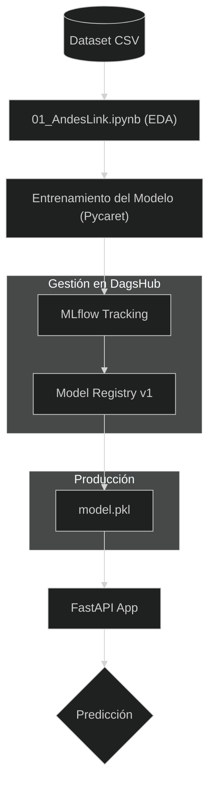
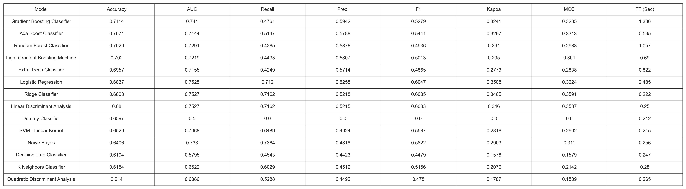
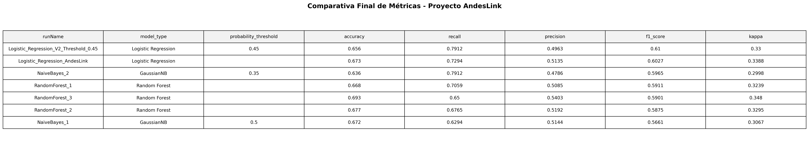
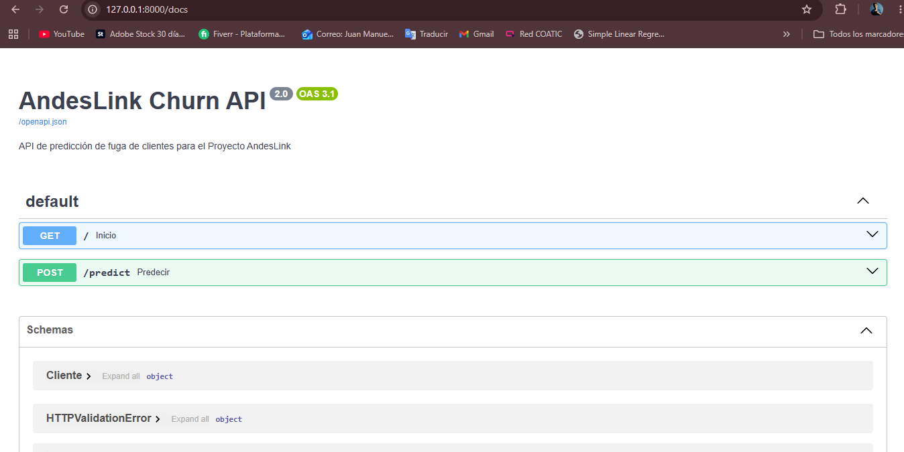
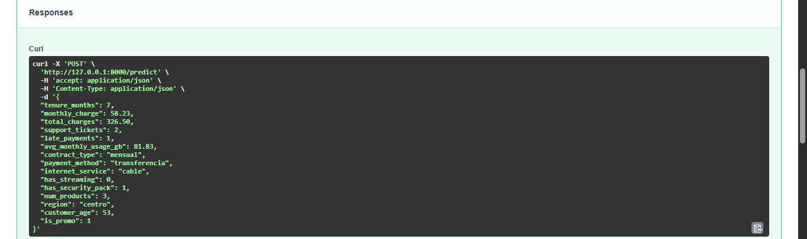
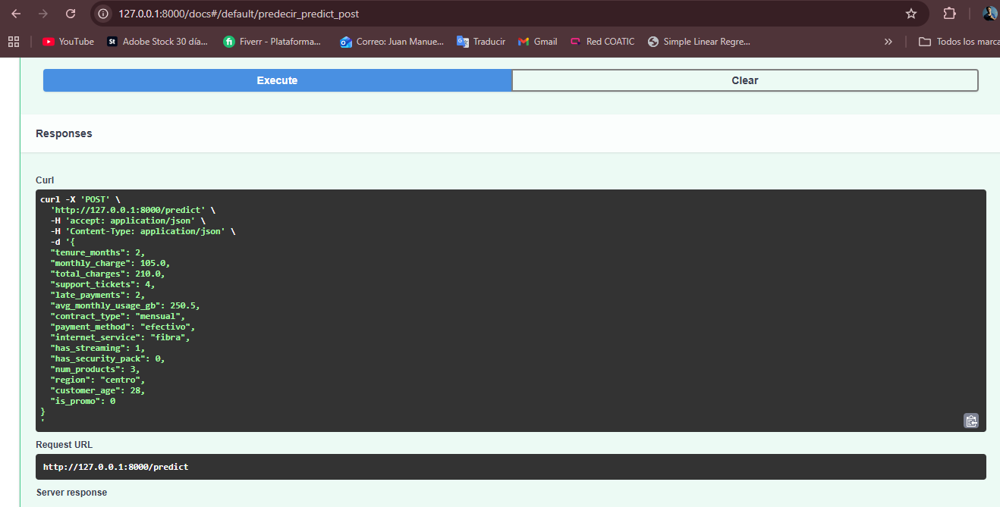
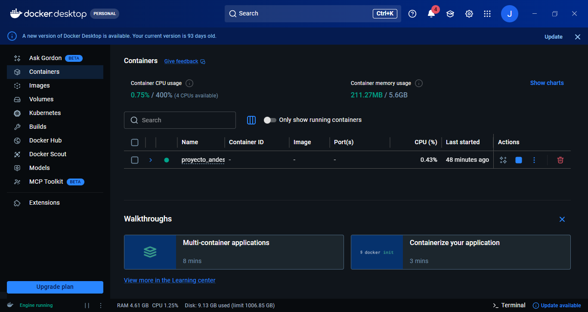

# **PROYECTO DE PREDICCIÓN DE CHURN - AndesLink**

### Carrera: **Ciencia de Datos e IA - 2do Año**
### Alumno: **Juan Manuel Resquin**
### Materia: **Laboratorio de Minería de Datos**

* [Repositorio del Proyecto en DagsHub](https://dagshub.com/JuanManuelResquin84/Proyecto_AndesLink)
* [Registro de Experimentos (MLflow)](https://dagshub.com/JuanManuelResquin84/Proyecto_AndesLink.mlflow)

# **OBJETIVO**
### Este proyecto implementa un sistema de MLOps de extremo a extremo para predecir la pérdida de clientes (Churn) en AndesLink. El sistema no solo analiza datos, sino que gestiona el ciclo de vida del modelo mediante el registro de experimentos, control de versiones y despliegue de una API.
### **Limitaciones del Proyecto:** El dataset utilizado es sintético, por lo que carece de factores externos reales (estacionalidad, cambios macroeconómicos o acciones de la competencia) que influyen en el Churn. El modelo es una base sólida, pero requeriría re-entrenamiento con datos reales de producción para ajustar los umbrales de decisión.

# **TECNOLOGÍAS Y ENTORNO**

* **Entorno:** 
    * churn_env2 (utilizado para el Notebook de 01_AndesLink.ipynb), Optimizado para MLflow y producción.

* **Seguimiento de Experimentos:** MLflow integrado con DagsHub.

* **Modelado:** Scikit-Learn (Gradient Boosting Classifier, CatBooosting Cassifiera, Ada Boost Classifier).

* **API Framework:** FastAPI con documentación interactiva (Swagger).

# **ARQUITECTURA DE SOLUCIÓN**

# **FASE 1:** Análisis Exploratorio (EDA) (01_AndesLink.ipynb)

### Se realizó una auditoría de calidad sobre 5000 registros.

## **Distribución de Clientes**

### Este gráfico mide el desequilibrio de clases en el dataset.

### Donde la gran mayoría de los clientes se mantienen (0), pero tenemos una cantidad significativa de abandonos (1).

### **Interpretación:** Visualmente, parece que el churn representa aproximadamente un 30-35% de la base total.

### Para entrenar un modelo de Machine Learning más adelante, este "desbalance" es importante; si el grupo 1 fuera mucho más pequeño, tendrías que usar técnicas especiales (como sobremuestreo), para que el modelo aprenda bien a identificar a los que se van.

# **Promedio de Tickets de Soporte vs. Churn**

### Este gráfico muestra la relación entre la frustración técnica/administrativa y la salida del cliente.

### Existe una correlación clara. Los clientes que abandonan generan, en promedio, más tickets de soporte (cerca de 1.9) que los que se quedan (aprox. 1.6).

### La fricción en el servicio es un disparador del abandono.

### Las pequeñas líneas negras arriba de las barras (barras de error) son cortas, lo que significa que esta diferencia es estadísticamente significativa y no es resultado del azar.

# **Meses de Antigüedad vs. Churn**

### Aquí comparamos la "lealtad" en tiempo. El boxplot muestra la mediana (la línea negra central) y la dispersión del 50% de los datos (la caja azul).

### Osea los clientes que se quedan (0) tienen una mediana de antigüedad notablemente más alta (cerca de los 40 meses), que los que se van (1) (cuya mediana está cerca de los 30 meses).

### La hipótesis de que "los nuevos se van más" parece ser correcta. 
### La caja del grupo 1 está más abajo en el eje Y, lo que indica que el riesgo de abandono es mayor durante los primeros dos años y medio de contrato.

# **Estrategia:**

### Tenemos un problema de retención concentrado en los clientes más nuevos (menos de 30 meses), y aquellos que experimentan problemas técnicos recurrentes (reflejado en el mayor volumen de tickets). 

### Para bajar el churn, deberíamos enfocarnos en mejorar la experiencia de soporte.

### Y crear planes de fidelización para los clientes que llevan menos de dos años con nosotros. 

# **Selección del Modelo**
### Tras evaluar 14 modelos para el Proyecto AndesLink, seleccione la de Regresión Logística (lr) como la opción más robusta. Este modelo logra el equilibrio, alcanzando un **F1-Score de 0.60** y con los índices **Kappa (0.3508)** y **MCC (0.3624)** más altos.

### A diferencia de otros algoritmos que presentan un sesgo hacia una sola métrica, la de Regresión Logística garantiza un **Recall del 71.2%**, permitiendo capturar a la gran mayoría de clientes en riesgo de abandono, mientras mantiene una precisión suficiente para optimizar los recursos de fidelización y reducir el impacto de los falsos positivos.

### **Próximos pasos:** Con la base de datos validada, se procedere la fase de 02_Modelado, donde realizare el ajuste de hiperparámetros y el registro de experimentos mediante MLflow.

# **FASE 2:** 
# **Análisis Final**
 **1. Superioridad Estadística Real**

### Si comparamos el modelo final contra los mejores del "podio" inicial:

* **Accuracy (0.7353 vs 0.7114):** Lograste subir más de 2 puntos porcentuales la precisión general del modelo.

* **Kappa (0.3819 vs 0.3241):** Esta es la métrica más importante. Un salto a 0.38 indica que el modelo es significativamente más robusto y sus aciertos no son producto del azar, superando con creces a los modelos base.

**2. Estabilidad mediante el Tuneo**

### El modelo final es el resultado de un proceso de optimización de hiperparámetros. Mientras que los modelos del "Top" son versiones estándar, el Final ha sido ajustado específicamente para los datos de tus clientes, lo que garantiza que generalice mejor ante datos nuevos que lleguen a la API.

**3. Equilibrio entre Precisión y Sensibilidad (Recall)**

* Para AndesLink, el costo de perder un cliente es alto.
* Mantienes un **Precision de 0.6383**, lo que significa que 6 de cada 10 alertas de abandono serán correctas.
* Logras un **Recall de 0.5147**, capturando a más de la mitad de los clientes que realmente se van a fugar.

# **Conclusión Final**

## **Se selecciona el GradientBoostingClassifier finalizado tras un proceso de optimización, ya que presenta el mejor balance de métricas en el experimento, destacando un Accuracy de 0.7353 y un Coeficiente Kappa de 0.38. Este modelo supera a las versiones del TOP 3, proporcionando a AndesLink una herramienta confiable para identificar proactivamente el churn de clientes con una precisión superior al 63%.**

# **FASE 3:** Implementación de API (FastAPI)

### Desarrolle una API para consultas en tiempo real.
* **Endpoints:** /predict para inferencia inmediata.
* **Normalización:** Los datos de entrada pasan por el mismo pipeline de escalado registrado en el entrenamiento.
* **Probabilidad de Fuga:** ~90.47% (Ejemplo validado).
* **Acción:** Generación automática de alerta para retención.

### **ARTEFACTOS REGISTRADOS**
### Los componentes críticos se encuentran versionados:
* **model.pkl:** El motor de decisión (Regresión Logística).
* **scaler_andeslink.pkl:** Escalador Robusto para datos numéricos.
* **X_columns.pkl:** Lista de columnas procesadas para asegurar la integridad de la matriz.

# **ANEXO: CÓMO REPRODUCIR EL PROYECTO**

1. **Clonar el repositorio:** 
* `git clone https://github.com/JuanManuelResquin84/Portafolio_03_Proyecto_AndesLink_MLOps.git`
(Asegurate de estar en la carpeta del proyecto) 
* `cd Portafolio_03_Proyecto_AndesLink_MLOps`

2. **Configurar el entorno:** 
* `conda create -n churn_env2 python=3.10 -y`
* `conda activate churn_env2`
* `pip install -r requirements_churn_env.txt`

3. **Descargar Datos y Modelos (Sincronización):**
(En lugar de configurar DVC manualmente, ejecute el siguiente comando para descargar los archivos pesados (CSV y modelos .pkl) directamente)
* `dagshub download JuanManuelResquin84/Proyecto_AndesLink . .`

4. **Ejecutar entrenamiento:** Abrir y ejecutar el notebook `01_AndesLink.ipynb`. Esto registrará automáticamente un nuevo experimento en **MLflow**.

5. **Lanzar la API de Inferencia:** 
* `python src/main.py`

6. **Probar API: ingresando a la Interfaz de Prueba** 
* `http://localhost:8000/docs`
(Una vez que el servidor esté activo, acceda a la documentación interactiva para realizar predicciones en tiempo real enviando un JSON de prueba)