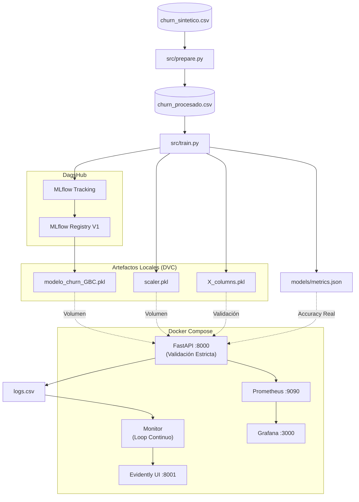

# **PROYECTO DE PREDICCIÓN DE CHURN - AndesLink**

### Carrera: **Ciencia de Datos e IA - 2do Año**
### Alumno: **Juan Manuel Resquin**
### Materia: **Laboratorio de Minería de Datos**
### Profesor: **Diego Mosquera**
---
>* [Repositorio del Proyecto en DagsHub](https://dagshub.com/JuanManuelResquin84/Proyecto_AndesLink)

>* [Registro de Experimentos (MLflow)](https://dagshub.com/JuanManuelResquin84/Proyecto_AndesLink.mlflow)
---
## **📋 TABLA DE CONTENIDOS**
1. [Objetivo](#objetivo)
2. [Arquitectura de Solución](#arquitectura-de-solución)
3. [Decisiones de Arquitectura](#decisiones-de-arquitectura)
4. [Tecnologías](#tecnologías)
5. [Fase 1: EDA](#fase-1-análisis-exploratorio-eda)
6. [Fase 2: Modelado](#fase-2-modelado-científico)
7. [Fase 3: API & Docker](#fase-3-api--dockerización)
8. [Fase 4: CI/CD](#fase-4-cicd-con-github-actions)
9. [Fase 5: Monitoreo (Evidently)](#fase-5-monitoreo-con-evidently-ai)
10. [Fase 6: Observabilidad (Prometheus+Grafana)](#fase-6-observabilidad-técnica)
11. [Reproducción del Proyecto](#anexo-cómo-reproducir-el-proyecto)
---
## **OBJETIVO**
### Implementar un sistema **MLOps End-to-End** para predecir churn en AndesLink, integrando:

> Control de versiones (Git + DVC)

> Tracking de experimentos (MLflow + DagsHub)

> API de inferencia robusta (FastAPI + Docker) con validaciones estrictas

> CI/CD (GitHub Actions + pytest)

> Monitoreo de datos (Evidently AI)

> Observabilidad técnica (Prometheus + Grafana)

---
## **ARQUITECTURA DE SOLUCIÓN**

---
## **DECISIONES DE ARQUITECTURA**
### **¿Por qué un contenedor separado para Evidently?**

| Servicio | Puerto | Propósito | Características |
| :--- | :--- | :--- | :--- |
| FastAPI | 8000 | Inferencia en tiempo real | Alta demanda, <100ms latencia |
| Evidently UI | 8001 | Dashboards de monitoreo | Baja demanda, visualización |
| Monitor | ----| Generación automática de reportes | reportes Loop continuo, reinicio automático |


### **Ventajas**

> Aislamiento: Si Evidently falla, la API sigue operando

> Recursos: Evidently consume RAM/CPU solo cuando se visualiza

> Independencia: Actualizas Evidently sin tocar la API

---
### **¿Por qué Python 3.11-slim para Evidently?**
| Imagen | Tamaño | Python | Uso |
| :--- | :---: | :---: | :--- |
| `python:3.10-slim` | ~150MB | 3.10 | API (compatibilidad con modelo) |
| `python:3.11-slim` | ~150MB | 3.11 | Evidently (última versión estable) |

### **Ventajas**

> **Compatibilidad:** Evidently requiere Python 3.8+, 3.11 es la más reciente estable

> **Seguridad:** Imagen "slim" = menos vulnerabilidades

> **Flexibilidad:** Cada servicio usa la versión óptima para su propósito

---
## **TECNOLOGÍAS**

### **Data Science & ML**

> **Scikit-Learn:** Gradient Boosting, CatBoost, AdaBoost

> **MLflow:** Tracking + Model Registry

> **DVC:** Versionado de datos y modelos
---
### **Infraestructura**

> **FastAPI + Uvicorn:** API REST  asíncrona con validaciones estrictas (Pydantic Literal + Field)

> **Docker + Docker Compose:** Contenedorización con 5 servicios

> **GitHub Actions:** CI/CD con pytest
---
### **Monitoreo**

> **Evidently AI:** Data drift detection

> **Prometheus:** Métricas de infraestructura

> **Grafana:** Dashboards técnicos
---
## **FASE 1:** ANÁLISIS EXPLORATORIO (EDA)

### **Distribución de Clientes**

>   **Churn Rate:** ~30-35% (dataset desbalanceado)

>  **Implicación:** Requiere métricas como Precision/Recall, no solo Accuracy


---
### **Tickets de Soporte vs Churn**

>  **Hallazgo:** Clientes que se van generan 1.9 tickets vs 1.6 los que se quedan

>  **Acción:** Mejorar calidad del soporte técnico


---
### **Antigüedad vs Churn**

>  **Hallazgo:** Mediana de 40 meses (se quedan) vs 30 meses (se van)

>  **Acción:** Programas de fidelización para clientes < 2.5 años


---
## **FASE 2:** MODELADO CIENTÍFICO

- **Modelo Seleccionado:** Gradient Boosting Classifier V1
- **Configuración Óptima:**

```json
{
    "n_estimators": 100,
    "learning_rate": 0.1,
    "max_depth": 3,
    "umbral_personalizado": 0.45  # Ajuste de negocio
}
```

---

### **Métricas Finales**
| Métrica | Valor | Interpretación de Negocio |
| :--- | :---: | :--- |
| **Precision** | 0.5714 | De 100 alertas, 57 son reales → Evita desperdicio de presupuesto |
| **Recall** | 0.5529 | Detectamos 55% de los que se van → Cobertura balanceada |
| **Kappa** | 0.3419 | Acuerdo estadístico sólido → No es azar |
| **Accuracy** | 0.7070 | 7/10 predicciones correctas → Consistencia global |
---
### **Justificación Estratégica**

>  **Problema de Negocio:** AndesLink tiene presupuesto limitado para campañas de retención.

---
### **Solución**

>  **Alta Precision (57%):** No regalamos descuentos a clientes fieles (minimizamos Falsos Positivos)

>  **Recall Moderado (55%):** No saturamos al equipo de atención al cliente

>  **ROI Optimizado:** El dinero ahorrado en falsas alarmas financia promociones de mayor valor

---


---
## **FASE 3:** API & DOCKERIZACIÓN
### **Endpoints Principales**
| Endpoint | Método | Propósito |
| :--- | :---: | :--- |
| `/` | **GET** | Health check |
| `/predict` | **POST** | Predicción de churn (con validación estricta) |
| `/metrics` | **GET** | Métricas Prometheus |
| `/docs` | **GET** | Swagger UI interactivo |

---

### **FValidaciones Estrictas de la API**

### La API implementa validaciones robustas para prevenir datos corruptos:

### **Validación de rangos numéricos (Pydantic Field)**

```json
customer_age: int = Field(ge=18, le=100, description="Edad del cliente")
tenure_months: int = Field(ge=1, le=120, description="Meses de antigüedad")
monthly_charge: float = Field(ge=10.0, le=500.0, description="Cargo mensual")
avg_monthly_usage_gb: float = Field(ge=0.0, le=350.0, description="Uso mensual en GB")
```

---

### **Validación de categorías (Pydantic Literal)**

```json
contract_type: Literal["mensual", "anual"]
payment_method: Literal["credito", "debito", "efectivo", "transferencia"]
internet_service: Literal["fibra", "cable", "dsl"]
region: Literal["norte", "sur", "centro", "este", "oeste"]
```

### **Resultado:** La API rechaza automáticamente (HTTP 422) cualquier categoría o valor fuera de rango, previniendo predicciones corruptas.

---
### **Ejemplos de Request Válidos**
```json
{
  "tenure_months": 7,
  "monthly_charge": 58.23,
  "total_charges": 326.50,
  "support_tickets": 2,
  "late_payments": 1,
  "avg_monthly_usage_gb": 81.83,
  "contract_type": "mensual",
  "payment_method": "transferencia",
  "internet_service": "cable",
  "has_streaming": 0,
  "has_security_pack": 1,
  "num_products": 3,
  "region": "centro",
  "customer_age": 53,
  "is_promo": 1
}
```

```json
{
  "tenure_months": 34,
  "monthly_charge": 89.99,
  "total_charges": 3059.66,
  "support_tickets": 0,
  "late_payments": 0,
  "avg_monthly_usage_gb": 450.25,
  "contract_type": "anual",
  "payment_method": "credito",
  "internet_service": "fibra",
  "has_streaming": 1,
  "has_security_pack": 1,
  "num_products": 5,
  "region": "sur",
  "customer_age": 28,
  "is_promo": 0
}
```

```json
{
  "tenure_months": 14,
  "monthly_charge": 45.50,
  "total_charges": 410.50,
  "support_tickets": 5,
  "late_payments": 6,
  "avg_monthly_usage_gb": 30.10,
  "contract_type": "mensual",
  "payment_method": "efectivo",
  "internet_service": "cable",
  "has_streaming": 0,
  "has_security_pack": 0,
  "num_products": 1,
  "region": "norte",
  "customer_age": 22,
  "is_promo": 1
}
```

```json
{
  "tenure_months": 60,
  "monthly_charge": 285.00,
  "total_charges": 17100.00,
  "support_tickets": 2,
  "late_payments": 0,
  "avg_monthly_usage_gb": 3200.75,
  "contract_type": "anual",
  "payment_method": "transferencia",
  "internet_service": "fibra",
  "has_streaming": 0,
  "has_security_pack": 1,
  "num_products": 8,
  "region": "centro",
  "customer_age": 45,
  "is_promo": 0
}
```

---

### **Arquitectura Docker**

### **servicios**

> api:          → FastAPI (puerto 8000)

> evidently:    →  Evidently UI (puerto 8001) - Instalación en build time

> monitor:    →  Servicio de monitoreo automatizado (loop continuo)

> prometheus:   → Métricas (puerto 9090)

> grafana:      → Dashboards (puerto 3000)

---

### **Métricas de Prometheus**

> ml_prediction_latency_seconds:    →  Histograma de latencia

> ml_predictions_total:    →  Contador de predicciones (por resultado)

> ml_model_accuracy:    →  Gauge con accuracy real del modelo (leído desde metrics.json)

> ml_last_prediction_score:    →  Gauge con el score de la última predicción

---

### **Volúmenes Compartidos**

> ./models → Modelo, scaler, columnas

> ./data → Dataset procesado + logs

> ./workspace → Snapshots de Evidently

---
# **FASE 4:** CI/CD CON GITHUB ACTIONS

### **Pipeline Automatizado**

```yaml
on: [push, pull_request]

jobs:
  test:
    runs-on: ubuntu-latest
    steps:
      - checkout
      - setup Python 3.10
      - install dependencies
      - download artifacts (DVC)
      - run pytest 
```

### **Beneficios**

> Calidad: Bloquea merges si los tests fallan

> Seguridad: Credenciales en GitHub Secrets

>Automatización: Sin intervención manual

---
## **FASE 5:** MONITOREO CON EVIDENTLY AI

### **Arquitectura de Monitoreo**

```json
 1. API recibe predicciones (con validación estricta)             
    ↓                                    
 2. Logs se guardan en logs.csv          
    ↓                                    
 3. Servicio MONITOR (loop continuo)                 
    - Lee logs.csv y churn_procesado.csv            
    - Aplica get_dummies + reindex (mismo que API)  
    - Genera reporte de drift                        
    - Sube snapshot a Evidently UI                  
    - Reintenta automáticamente si falla        
    ↓                                                                       
 5. Evidently UI (localhost:8001)        
    - Visualiza drift en tiempo real                   
    - Dashboard con métricas clave 
```

### **Servicio Monitor Automatizado**

### El monitoreo ya NO es manual. Se implementó un servicio Docker dedicado que:

> Corre en loop continuo con intervalo configurable (MONITOR_INTERVAL_SECONDS)

> Se reinicia automáticamente ante fallos (restart: unless-stopped)

> Espera a que Evidently esté listo antes de arrancar (condition: service_healthy)

> Valida que haya suficientes logs antes de generar reporte (MIN_LOGS = 30)

### **Script Principal:** push_to_ui.py

### El pipeline de monitoreo se consolidó en un único script que:

> Carga churn_procesado.csv (referencia, ya codificado)

> Carga logs.csv (producción)

> Aplica pd.get_dummies + reindex contra X_columns.pkl (misma lógica que la API)

> Genera reporte con DataDriftPreset + DataSummaryPreset

> Sube el snapshot a Evidently UI

> Generación de Tráfico de Prueba

### Se creó generar_trafico_prueba.py para simular tráfico realista:

> Cubre todas las categorías reales del dataset

> Usa distribución normal calibrada con media y desvío reales

> Recorta valores a rangos observados en entrenamiento

> Reduce drift artificial, dejando solo drift genuino

### **Dashboard Evidently**

> Acceso: http://localhost:8001

### **Métricas Monitoreadas**

> **Data Drift:** Cambios en distribución de variables

> **Data Summary:** Estadísticas descriptivas

> **Alertas:** Variables con drift significativo

---

# **FASE 6:** OBSERVABILIDAD TÉCNICA

### **Stack Prometheus + Grafana**

| Componente | Puerto | Función |
| :--- | :---: | :--- |
| **Prometheus** | 9090 | Recolecta métricas de la API |
| **Grafana** | 3000 | Visualiza dashboards |

### **Métricas Exportadas por FastAPI**

> ml_prediction_latency_seconds: Histograma de latencia

> ml_predictions_total: Contador de predicciones (por resultado)

> ml_model_accuracy: Gauge con accuracy real (leído desde metrics.json)

> ml_last_prediction_score: Gauge con score de última predicción

### **Dashboard Grafana** 

> Acceso: http://localhost:3000 (admin/admin)

### **Paneles:**

> Requests por minuto

> Latencia p95, p99

> Tasa de errores HTTP

> Distribución de predicciones (Fuga vs Se queda)

> Último score de predicción

# **ANEXO:** CÓMO REPRODUCIR EL PROYECTO

### **1. Clonar Repositorio**

```json
git clone https://github.com/JuanManuelResquin84/Portafolio_03_Proyecto_AndesLink_MLOps.git
cd Portafolio_03_Proyecto_AndesLink_MLOps
```

### **2. Configurar Entorno**

```json
conda create -n churn_env2 python=3.10 -y
```

```json
conda activate churn_env2
```

```json
pip install -r requirements_churn_env2.txt
```

### **3. Descargar Datos y Modelos (DagsHub)**

```json
dagshub download JuanManuelResquin84/Proyecto_AndesLink . .
```

### **4. Levantar Infraestructura Docker**

```json
docker compose up --build
```

**Servicios disponibles**

> **API:** http://localhost:8000/docs

> **Evidently UI:** http://localhost:8001

> **Monitor:** Servicio automático (sin puerto expuesto)

> **Prometheus:** http://localhost:9090

> **Grafana:** http://localhost:3000


### **5. Generar Tráfico de Prueba (Opcional)**

```json
python script/generar_trafico_prueba.py
```

> Esto genera predicciones realistas contra la API para poblar logs.csv.

### **6. Probar API**

### **Vía Swagger UI**

```json
Ir a http://localhost:8000/docs
Endpoint /predict → Try it out
Enviar JSON de prueba  (usar ejemplos válidos de la Fase 3)
```

### **Vía curl**

```json
curl -X POST "http://localhost:8000/predict" \
  -H "Content-Type: application/json" \
  -d '{
    "tenure_months": 24,
    "monthly_charge": 75.5,
    "total_charges": 1800.0,
    "support_tickets": 3,
    "late_payments": 2,
    "avg_monthly_usage_gb": 15.5,
    "contract_type": "mensual",
    "payment_method": "credito",
    "internet_service": "fibra",
    "has_streaming": 1,
    "has_security_pack": 0,
    "num_products": 2,
    "region": "norte",
    "customer_age": 28,
    "is_promo": 1
  }'
```

### **7. Verificar Monitoreo Automático**

### El servicio monitor genera reportes automáticamente. Para ver los resultados:

> Esperar 1-2 minutos después de generar tráfico

> Ir a http://localhost:8001

> Entrar al proyecto "Monitoreo_AndesLink"

> Ver reportes de Data Drift y Data Summary

# **ESTRUCTURA DEL PROYECTO**

```json
Proyecto_AndesLink/
├── data/
│   ├── churn_sintetico.csv         # Dataset original
│   ├── churn_procesado.csv         # Dataset procesado (DVC)
│   └── logs.csv                    # Logs de predicciones
── models/
│   ├── modelo_churn_GBC_andeslink.pkl  # Modelo (DVC)
│   ├── scaler_andeslink.pkl            # Scaler (DVC)
│   ├── X_columns.pkl                   # Columnas (DVC)
│   ── metrics.json                    # Métricas reales del modelo
├── src/
│   ├── prepare.py                  # Pipeline de preparación
│   ├── train.py                    # Pipeline de entrenamiento
│   └── main.py                     # FastAPI app (con validaciones estrictas)
├── script/
│   ├── push_to_ui.py               # Monitoreo automatizado (consolidado)
│   └── generar_trafico_prueba.py   # Generación de tráfico realista
├── tests/
│   └── test_api.py                 # tests unitarios
├── prometheus/
│   └── prometheus.yml              # Config Prometheus
├── workspace/                      # Snapshots Evidently
├── reports/                        # Imágenes y reportes
├── docker-compose.yml
── Dockerfile                      # API
├── Dockerfile.evidently            # Evidently (build time)
├── requirements_churn_env2.txt
└── README.md
```

# **NOTAS DE SEGURIDAD**

> Credenciales: Usar GitHub Secrets para DAGSHUB_TOKEN

> Contenedor de Inferencia: Sin credenciales de escritura MLflow

> Imágenes Oficiales: python:3.10-slim, grafana:10.2.0, prom/prometheus:v2.45.0

> Red Aislada: andeslink_network (bridge driver)

> Validación Estricta: Pydantic Literal + Field previene inyección de datos inválidos
