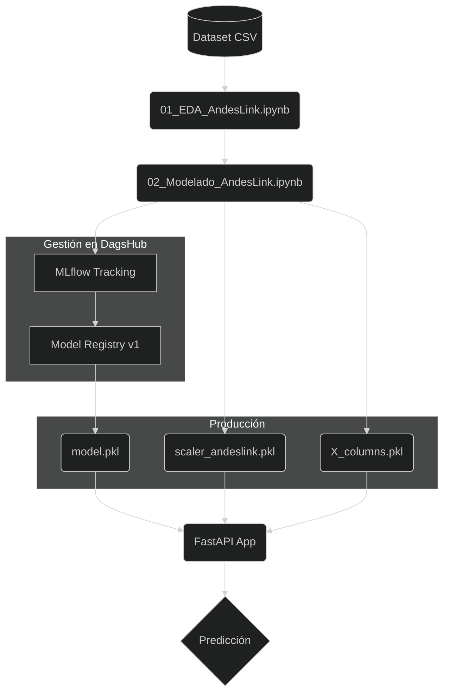

# **PROYECTO DE PREDICCIÓN DE CHURN - AndesLink**

### Carrera: **Ciencia de Datos e IA - 2do Año**
### Alumno: **Juan Manuel Resquin**
### Materia: **Laboratorio de Minería de Datos**

* [Repositorio del Proyecto en DagsHub](https://dagshub.com/JuanManuelResquin84/Proyecto_AndesLink)
* [Registro de Experimentos (MLflow)](https://dagshub.com/JuanManuelResquin84/Proyecto_AndesLink.mlflow)

# **OBJETIVO**
### Este proyecto implementa un sistema de MLOps de extremo a extremo para predecir la pérdida de clientes (Churn) en AndesLink. El sistema no solo analiza datos, sino que gestiona el ciclo de vida del modelo mediante el registro de experimentos, control de versiones y despliegue de una API.

# **TECNOLOGÍAS Y ENTORNO**

* **Entorno:** 
  * pycaret_env (utilizado para el Norebook de 01_EDA_AndesLink.ipynb), ya que tenia conflictos con la libreria de MLflow, pero me sirvio para decidirme por el modelo de entrenamiento.
  * churn_env (utilizado para el Norebook de 02_Modelado_AndesLink.ipynb), Optimizado para MLflow y producción.

* **Seguimiento de Experimentos:** MLflow integrado con DagsHub.

* **Modelado:** Scikit-Learn (Logistic Regression, Random Forest, Naive Bayes).

* **API Framework:** FastAPI con documentación interactiva (Swagger).

# **ARQUITECTURA DE SOLUCIÓN**

# **FASE 1:** Análisis Exploratorio (EDA)

### Se realizó una auditoría de calidad sobre 5000 registros.

* **Hallazgo Crítico:** Desbalance del 34% en la tasa de abandono.

* **Visualización:** Se generaron reportes de métricas comparativas iniciales.

FASE 2: Experimentación y MLOps
A diferencia de un flujo tradicional, aquí se implementó un gobierno de modelos:

Tracking: Cada entrenamiento (Naive Bayes, Random Forest, Regresión Logística) quedó registrado en DagsHub con sus métricas de Accuracy, Recall y F1-Score.

Modelo Ganador: Se seleccionó Logistic Regression (V2) por su robustez, aplicando un umbral personalizado de 0.45 para maximizar la captura de clientes en riesgo.

Model Registry: El modelo fue promovido a la pestaña de Models en DagsHub para control de versiones.

FASE 3: Implementación de API (FastAPI)
Se desarrolló una API robusta para consultas en tiempo real.

Endpoints: /predict para inferencia inmediata.

Normalización: Los datos de entrada pasan por el mismo pipeline de escalado registrado en el entrenamiento.

Resultado de Inferencia:

Probabilidad de Fuga: ~90.47% (Ejemplo validado).

Acción: Generación automática de alerta para retención.

(Asegúrate de tener este archivo en la carpeta reports)

ARTEFACTOS REGISTRADOS
Los componentes críticos se encuentran versionados:

model.pkl: El motor de decisión (Regresión Logística).

scaler_andeslink.pkl: Escalador Robusto para datos numéricos.

X_columns.pkl: Lista de columnas procesadas para asegurar la integridad de la matriz.

Notas para el ajuste de imágenes:
Nombre de archivos: He incluido tabla_comparativa_modelos.png que es el que tu notebook de EDA genera al final.

Captura de API: Te recomiendo sacar una captura a tu Swagger (la pantalla verde donde sale el score de 0.9047) y guardarla como evidencia_api_swagger.png en la carpeta reports para que el enlace del README funcione.

Ubicación: El README asume que está en la raíz del proyecto, por eso usa ../reports/ para buscar las fotos.

