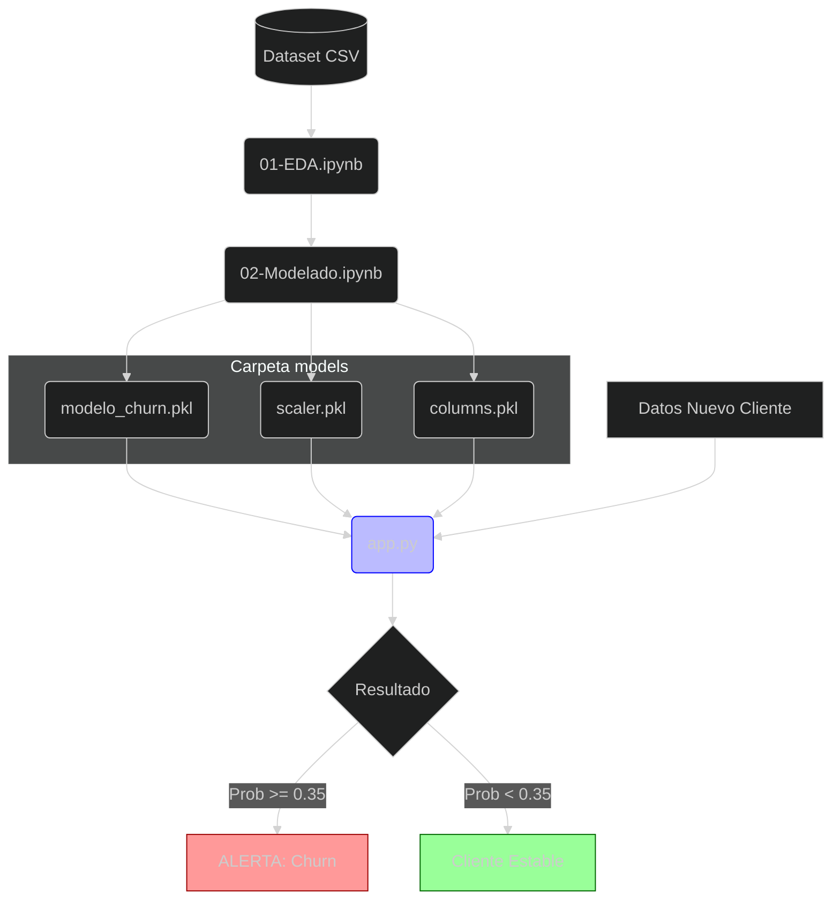

# **Proyecto de Predicción de Churn - AndesLink**
## Alumno: **Juan Manuel Resquin**
## Curso: **Ciencia de Datos e IA - 2do Año**
## Materia: **Laboratorio de Minería de Datos**

# **OBJETIVO**
## Este proyecto aborda la problemática de la pérdida de clientes (Churn) en la empresa de telecomunicaciones AndesLink. El objetivo es identificar patrones de comportamiento en los usuarios para predecir quiénes podrían abandonar el servicio y así proponer acciones de retención.
## Esta primera etapa se centra en el Análisis Exploratorio de Datos (EDA) y la Preselección de Modelos de Entrenamiento utilizando aprendizaje automatizado.

# **Tecnologías y Entorno**
## Para este desarrollo se configuró un entorno aislado a fin de evitar conflictos de dependencias:
* **Entorno: pycaret_env**
* **Librerías Principales:**
  * Pandas & Numpy: Manipulación de datos.
  * Seaborn & Matplotlib: Visualización estadística.
  * PyCaret: Clasificación y evaluación rápida de modelos.
* **Dataset:** churn_sintetico.csv (5000 registros, 16 variables).

# **ARQUITECTURA DE SOLUCIÓN**
## Representación lógica del flujo de trabajo, desde el procesamiento de datos en los Notebooks hasta la ejecución del script de inferencia.

# **FASE 1: Desarrollo del Informe Técnico**
## **1. Análisis Exploratorio de Datos (EDA)**
## Se realizó una auditoría de calidad de datos sobre el dataset inicial, obteniendo los siguientes hallazgos:
* **Integridad:** El dataset no presenta valores nulos ni registros duplicados.
* **Perfil del Cliente:** La edad de los usuarios oscila entre los 18 y 78 años.
* **Tasa de Abandono (Target):**Se identificó un desbalance de clases donde aproximadamente el 34% de los clientes (1702 de 5000) han abandonado el servicio.

# **2. Segmentación y Comportamiento**
## A través de tablas de contingencia, se analizaron las variables críticas:
* **Servicio de Internet:** Los clientes con servicio móvil presentan la tasa de abandono más alta (~51%), seguidos por el cable (~35%).
* **Servicios Adicionales**: El uso de streaming y packs de seguridad mostraron un impacto marginal en la decisión de abandono en comparación con el tipo de contrato y método de pago.

# **3. Ingeniería de Datos y Preprocesamiento**
## Antes del entrenamiento, se preparó el entorno mediante la función setup de PyCaret, que automatiza:
* La codificación de variables categóricas.
* El manejo del desbalance de clases.
* La normalización de variables numéricas como monthly_charge y tenure_months.

# **4. Selección del Modelo**
## Se evaluaron múltiples algoritmos de clasificación de forma simultánea. El objetivo principal es optimizar el AUC (Area Under the Curve) y el Recall, para minimizar los falsos negativos (clientes que el modelo no detecta que se van a ir).

# **Resultados Preliminares**
## Se identificó que variables como la antigüedad (tenure) y los cargos mensuales son los predictores más fuertes del Churn.
## El modelo seleccionado en esta etapa sirve como base (baseline) para la optimización de hiperparámetros que se realizará en la siguiente fase.

# **Próximos Pasos**
## **Integración de Herramientas:** Migración al archivo 02-Modelado_AndesLink.ipynb para incorporar MLflow y DagsHub para el seguimiento de experimentos.
## **Optimización:** Ajuste fino de hiperparámetros del modelo líder.
## **Despliegue:** Preparación del modelo para su puesta en producción.

>Nota:  Durante esta fase, se decidió no integrar MLflow/DagsHub temporalmente debido a incompatibilidades directas con la versión de PyCaret utilizada, priorizando la agilidad en la selección del modelo.

# **FASE 2: Experimentación y Modelado**
## En esta etapa se transformó el análisis estático en un modelo predictivo funcional. Se realizaron las siguientes tareas técnicas:
* **Entrenamiento Multimodelo:** Se compararon diversos algoritmos (Random Forest, Gradient Boosting, Naive Bayes, etc.) utilizando validación cruzada.
* **Selección del modelo ganador:** El modelo Naive Bayes (versión nbV1) fue seleccionado debido a su excelente equilibrio entre tiempo de respuesta (latencia) y capacidad para identificar casos de fuga (Recall), crucial para una estrategia proactiva.
* **Persistencia de Artefactos:** Se exportaron los componentes necesarios para producción mediante joblib:
* **modelo_churn_nbV1_andeslink.pkl:** El motor de decisión.
* **scaler_andeslink.pkl:** El normalizador de datos numéricos.
* **X_columns.pkl:** El esquema técnico de las variables.

# **FASE 3: Implementación y Predicción en Tiempo Real**
## Se desarrolló un módulo de producción (app.py) que permite ejecutar el modelo sobre datos de clientes nuevos.

## **Proceso Técnico de Inferencia:**
* **Carga Dinámica:** Uso de os.path y normpath para garantizar que el script funcione en cualquier carpeta del proyecto.
* **Alineación de Datos:** Procesamiento de variables categóricas mediante get_dummies y re-indexación automática para evitar errores de dimensiones si faltan categorías en la entrada.
* **Escalado Sensible:** Aplicación de la misma transformación estadística utilizada en el entrenamiento para asegurar la integridad de la predicción.
* **Ajuste de Umbral (Thresholding):** Se implementó un umbral personalizado de 0.35. Esto permite al negocio ser más sensible ante posibles fugas, capturando clientes en riesgo que un umbral estándar de 0.50 podría omitir.

## **Validación del Sistema:**
## Se realizó una prueba de estrés con un cliente de ejemplo, obteniendo una ejecución exitosa en 3.7 segundos con los siguientes resultados:

### ✅ Validación del Sistema
Se realizó una prueba de estrés con un cliente de ejemplo, obteniendo una ejecución exitosa con los siguientes resultados:

| Métrica | Resultado |
| :--- | :--- |
| **Probabilidad de Abandono** | 76.42% |
| **Decisión (Umbral 0.35)** | **ALERTA: Churn (Fuga)**|
| **Tiempo de Ejecución** | 3.717 segundos |
| **Estado del Proceso** | `Exited with code=0` (Exitoso) |

>Nota: El modelo procesó la solicitud en menos de 4 segundos, lo que demuestra una latencia apta para consultas en tiempo real o integración en dashboards de atención al cliente.

